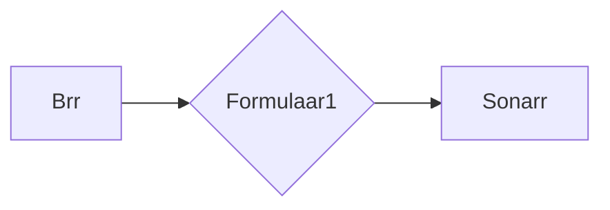

# Formulaar1

This is a small tool that I have written to attempt to automate Formula 1 Release pushes to Sonarr.



Basic Install Guide

Pre Built Binary.

1.	Download the latest release from Github

2.	Extract in to a folder.

3.	Edit appsettings.json with the required settings.

	```json
	  "TorrentClient": "qBittorrent", //Currently only qBittorrent is supported
	  "APICredentials": {
		"Sonarr": {
		  "ApiKey": "", //Key from the general tab in Sonarr
		  "BasePath": "http://127.0.0.1:8989" //Full URL to the Sonarr API
		},
		"qBittorrentClient": {
		  "Username": "", //qBittorrent Web Username
		  "Password": "", //qBittorrent Web Password
		  "BasePath": "http://127.0.0.1:10169" //Full URL to the qBittorrent API
		}
	  }
	  ```
	  
	You can then launch Formulaar1 to test it by typing `./Formulaar1`
	  
4. This can replace your original Sonarr client in Brr if you want. Please set this up so that it points to the port listed when you start Formulaar1

```
info: Microsoft.Hosting.Lifetime[14]
     Now listening on: http://localhost:5000
info: Microsoft.Hosting.Lifetime[14]
     Now listening on: https://localhost:5001
```
	  
In this example we are going to use port 5000

Create a new Client in Brr with the Type as Sonarr and host as http://127.0.0.1:5000 (from the above example) and with your normal Sonarr API key.

Clicking test should give you the Green OK.

You then need to setup a filter to point to this new Client you made and that should really be it :)

Please raise any issues if you have any problems.
